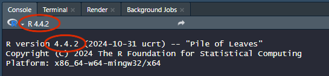
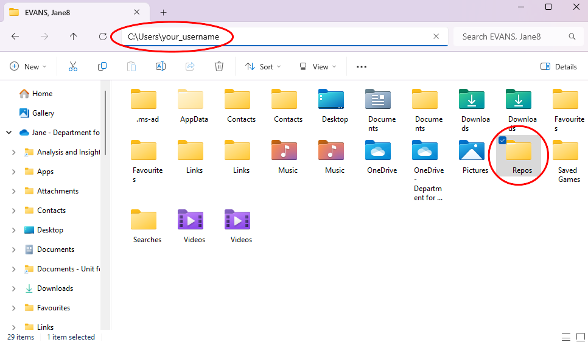
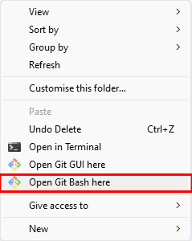
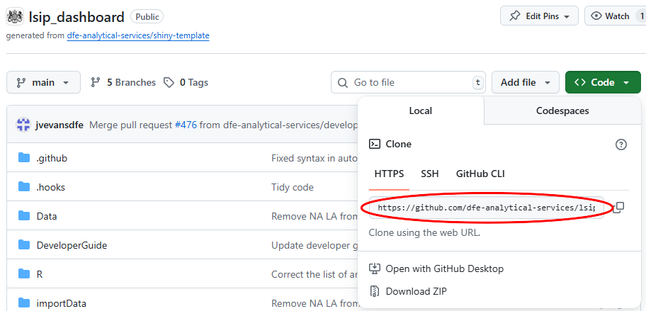

# Local skills getting started guide

- [Introduction](#introduction)
- [View the live dashboard](#view-the-live-dashboard)
- [Prepare to run the dashboard in R](#prepare-to-run-the-dashboard-in-r)
- [Run the dashboard in R](#run-the-dashboard-in-r)
- [Where to go next](#where-to-go-next)

## Introduction

The Local Skills dashboard is an R Shiny dashboard displaying published
local data from a variety of sources, in an easy to navigate format. To
support local skills planning, the dashboard covers topics such as
employment, qualifications, and education outcomes across England.

This guide is for developers who are new to the dashboard and would like 
to set up the project and run the dashboard in R for the first time.

## View the live dashboard

Anyone can view the public dashboard, here:

<https://department-for-education.shinyapps.io/local-skills-dashboard/>

We also have a 'pre production dashboard' where we test the dashboard 
before publishing. The URL is below but you will need to contact the project 
team for access. You don't need access to follow the rest of this getting 
started guide.

<https://department-for-education.shinyapps.io/dev-local-skills-dashboard/>

## Prepare to run the dashboard in R

### Step 1 - Download the required software

- Open Software Center on your laptop. You can navigate to it by searching 
“Software Center” in the search section of the task bar.

- Download the following software:

  - R for Windows 4.4 or higher
  - RStudio
  - RTools 4.4 or higher
  
- You will also need to install Git, which is version control software. You 
can download this directly from the [Git for windows website](https://gitforwindows.org/). 
Once the installer has started, follow the instructions as provided 
in the Git Setup wizard screen until the installation is complete.

> [!IMPORTANT]
> It is important that R and RTools are compatible versions. For example, if 
R is 4.4, RTools also needs to be 4.4.

When downloading R and Rtools, you can check the version number under the name 
of the software in the Software Center or by clicking on the software and 
looking for “Version:” in the information.

You can check the R version you’re using in RStudio by checking 
under the console tab or looking at the information shown in the console on 
start up. You can also run the function getRversion() in the console.

> [!TIP]
> If you have the latest version of R downloaded but RStudio still shows an 
older one, use [this guide to help you switch to the version of R you need](https://bioinformatics.ccr.cancer.gov/docs/rtools/R%20and%20RStudio/2.6_switching_r_version/).

### Step 2 - Clone the repository

The code for the dashboard is stored in [a repository on GitHub](https://github.com/dfe-analytical-services/lsip_dashboard). 
This allows us to collaborate on the project using version control. 

You will need to 'clone' the repository (known as a 'repo'), so that you can
work on and run the code on your own machine. To do this, navigate to a folder 
where you would like to store your copy of the repo. This should be outside of 
your OneDrive area. To do this, click on documents, then click on the file path
and delete everything up to your username. This should take you to your user 
folder outside of OneDrive. You can make a folder there to store all your 
repos.

Once you have done this, open your new repos folder and right click 
anywhere in the folder. Select 'Open Git Bash here' in the menu. If this doesn't 
appear as an option, go back to step one and make sure you have installed Git.

Next, go to the [repository on GitHub](https://github.com/dfe-analytical-services/lsip_dashboard),
click on code in the top right hand corner and then copy the URL in the
HTTPS section.

In the Git Bash console window you opened earlier, after the $ type `git clone`,
leave a space and then paste the URL. Press Enter. This should start cloning 
the repository. You only need to do this once, unless you later delete your 
cloned folder. 

> [!TIP]
> You can't paste into the Git Bash console using Ctrl + V, instead you can 
right click and choose paste, or you can click the middle roller button on your
mouse if you have one.

There are more details about using Git and GitHub, and a link to full training,
in the main [Developer Guide](https://github.com/dfe-analytical-services/lsip_dashboard/blob/main/DeveloperGuide/LocalSkillsDeveloperGuide.md).

# Run the dashboard in R

### Step 1 - Open the project in R

Navigate to the lsip_dashboard folder in your repos folder, find the RStudio 
project file (called lsip_dashboard), and open it in RStudio.

### Step 2 - Update the packages

The dashboard uses a package called renv to track and manage all the other
R packages used by the dashboard.  

To align your packages with the dashboard packages, run `renv::restore()` in 
the R console. The first time you do this, it will list a large number of
required installations. Type `Y` in the console and press enter to start
installing them. Once this is complete run `renv::status()`, which should
generate the message "No issues found -- the project is in a consistent state."

If you don't get this message, run `renv::restore()` again; packages sometimes
fail to install, especially when trying to install a large number in one go. If
this still doesn't work, go back to step one and check you have the right versions
of R and RTools installed, then try again.

You will need to restore renv again each time you work on the dashboard, but 
normally only a few packages will need updating.

### Step 3 - You are ready to run the dashboard!

To launch a local version of the dashboard, run `shiny::runApp()` in the 
R console. This should launch the dashboard in a new window. 

> [!NOTE]
> You will not be able to run any other code in R while the dashboard is 
running. To stop running the dashboard, close the dashboard window.

# Where to go next

If you are planning to contribute to the project, the [Developer Guide](https://github.com/dfe-analytical-services/lsip_dashboard/blob/main/DeveloperGuide/LocalSkillsDeveloperGuide.md) 
contains more detailed information on how to work on the project, including 
links to further training on using Git. 
